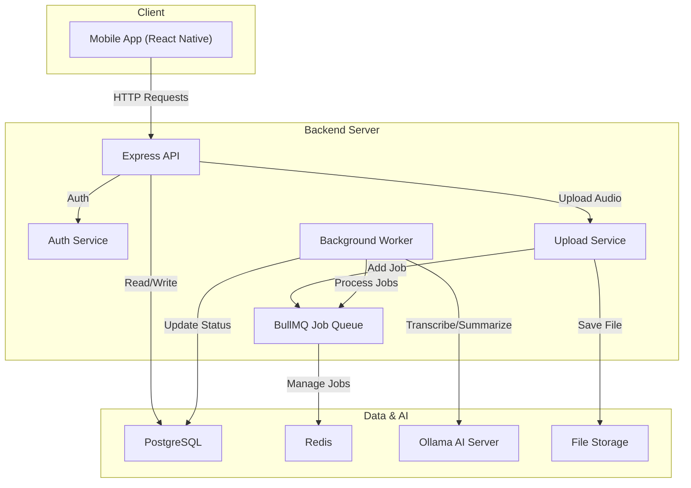
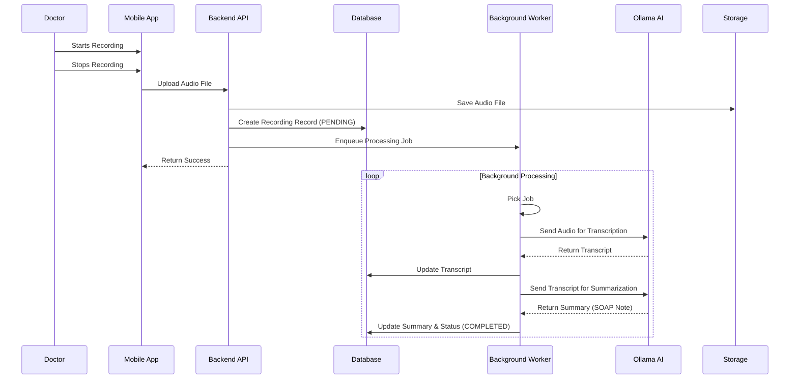

# MediAssist+ 🏥

**MediAssist+** is an advanced, AI-powered medical assistant application designed exclusively for doctors. It streamlines patient management and consultation documentation through intelligent audio recording, transcription, and summarization.

---

## 🚀 Tech Stack

### **Frontend (Mobile App)**
-   **Framework:** [React Native](https://reactnative.dev/) with [Expo](https://expo.dev/)
-   **Language:** [TypeScript](https://www.typescriptlang.org/)
-   **Routing:** [Expo Router](https://docs.expo.dev/router/introduction/)
-   **HTTP Client:** [Axios](https://axios-http.com/)
-   **State Management:** React Context API
-   **Styling:** StyleSheet (Custom Design System)

### **Backend (API Server)**
-   **Runtime:** [Node.js](https://nodejs.org/)
-   **Framework:** [Express.js](https://expressjs.com/)
-   **Language:** TypeScript
-   **Database ORM:** [Prisma](https://www.prisma.io/)
-   **Database:** [PostgreSQL](https://www.postgresql.org/)
-   **Queue System:** [BullMQ](https://docs.bullmq.io/) with [Redis](https://redis.io/)
-   **File Storage:** Local Storage (Default) / AWS S3 (Optional - Currently Disabled)

### **AI & Machine Learning**
-   **LLM Engine:** [Ollama](https://ollama.com/)
-   **Transcription:** Whisper (via Ollama/Python)
-   **Summarization:** DeepSeek / Llama3 / Mistral (via Ollama)
-   **Translation:** Google Cloud Translation API (Optional) / Ollama

---

## 🏗️ Architecture



---

## 🔄 Data Flow: Consultation Recording



---

## 🛠️ Setup Instructions

### Prerequisites
-   Node.js (v18+)
-   Docker & Docker Compose (for PostgreSQL & Redis)
-   Ollama (running locally or on a server)

### 1. Backend Setup

1.  Navigate to the backend directory:
    ```bash
    cd backend
    ```

2.  Install dependencies:
    ```bash
    npm install
    ```

3.  Configure Environment Variables:
    -   Copy `.env.example` to `.env`
    -   Update `DATABASE_URL` and `REDIS_URL` if needed.
    -   Ensure `OLLAMA_API_URL` points to your Ollama instance.

4.  Start Database & Redis (using Docker):
    ```bash
    docker-compose up -d
    ```

5.  Run Database Migrations:
    ```bash
    npx prisma db push
    ```

6.  Start the Server:
    ```bash
    npm run dev
    ```

### 2. Frontend Setup

1.  Navigate to the project root:
    ```bash
    cd ..
    ```

2.  Install dependencies:
    ```bash
    npm install
    ```

3.  Start the Expo Development Server:
    ```bash
    npx expo start
    ```
    -   Press `a` for Android Emulator
    -   Press `i` for iOS Simulator

### 3. AI Setup (Ollama)

1.  Install [Ollama](https://ollama.com/).
2.  Pull the required models:
    ```bash
    ollama pull whisper
    ollama pull deepseek-llm:7b
    ```
3.  Start the Ollama server:
    ```bash
    ollama serve
    ```

---

## 📱 Features

-   **Doctor Authentication:** Secure signup and login for medical professionals.
-   **Patient Management:** Add, view, and edit patient details.
-   **Audio Recording:** Record consultations directly within the app.
-   **AI Transcription:** High-accuracy speech-to-text for medical conversations.
-   **Intelligent Summarization:** Automatically generates structured SOAP notes (Subjective, Objective, Assessment, Plan).
-   **Multi-language Support:** Translation capabilities for summaries and transcripts.
-   **PDF Reports:** Generate and share patient reports.

---

## 🤝 Contributing

1.  Fork the repository.
2.  Create a feature branch (`git checkout -b feature/amazing-feature`).
3.  Commit your changes (`git commit -m 'Add some amazing feature'`).
4.  Push to the branch (`git push origin feature/amazing-feature`).
5.  Open a Pull Request.
